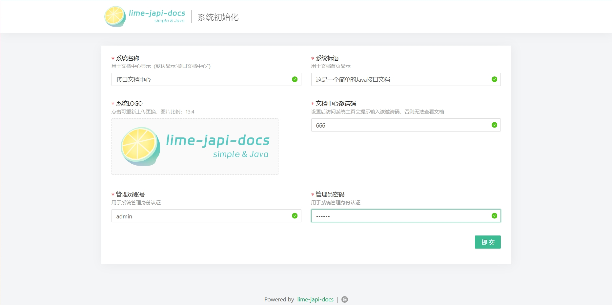

# lime-japi-docs


## 1 简介

lime-japi-docs是一个简单的Java接口文档生成工具，通过解析Java源码及其注释生成Controller接口文档，可在网页端管理、生成和浏览文档。项目打包为独立可执行jar包，对解析的源码零侵入，直接运行后在网页上进行初始化和配置即可。若只想解析获取Controller源码接口数据，只需要在自己项目中引入核心解析包「[lime-japi-docs-parser](https://gitee.com/xuchenoak/lime-japi-docs-parser)」进行解析即可，核心包已开源并上传至maven中央仓库。

运行环境：JDK1.8+

## 2 下载

1. 下载地址：[点击下载](https://gitee.com/xuchenoak/lime-japi-docs/releases)

2. 体验地址：[点击跳转](https://ljd.xuchenoak.com)

    邀请码：666  管理登录账/密：admin/123456
3. 页面截图：

|  |  |
|---|---|
|  |  |

## 3 使用

### 3.1 源码注释（生成的文档示例可以从上面的体验地址查看）

1. Controller及接口方法注释示例：

```java

/**
 * 用户管理业务接口
 **/
@Validated
@RestController
@RequestMapping("/user")
public class UserController {

   /**
    * 获取用户列表
    * @param username 用户名（搜索）
    * @param age 年龄（搜索）
    * @param sex 性别（搜索）
    * @return
    */
   @GetMapping("/list")
   public AjaxResult<List<UserVo>> list(String username, Integer age, String sex) {
      // ……
      return AjaxResult.suc();
   }

   /**
    * 新增用户
    * @return
    */
   @PostMapping("/add")
   public AjaxResult<UserVo> add(UserAddRf rf) {
      // ……
      return AjaxResult.suc();
   }

   // ……

}
```

2. 接口方法入参类注释示例：

   目前参数验证仅支持注解：@NotBlank（返回“字符非空”）、@NotNull（返回“对象非空”）、@Size（返回注解message的值）

```java
/**
 * 用户信息入参
 **/
@Data
public class UserAddRf {

   /** 用户名 */
   @NotBlank(message = "用户名不能为空")
   private String username;

   /** 年龄 */
   @NotNull(message = "用户年龄不能为空")
   private Integer age;

   /** 性别 */
   @NotBlank(message = "用户性别不能为空")
   private String sex;

   /** 归属部门 */
   @NotNull(message = "归属部门不能为空")
   private List<Integer> deptIdList;

}
```

3. 接口方法出参类注释示例：

```java
/**
 * 用户实体
 **/
@Data
public class UserVo {

   /** 用户名 */
   private String username;

   /** 年龄 */
   private Integer age;

   /** 性别 */
   private String sex;

   /** 归属部门 */
   private List<Dept> deptList;

}
```

### 3.2 运行服务

1. 下载压缩包解压后打开`application.yml`配置`docs-parser`下的`javaFilePaths`（Java源码路径）

   注：（1）启动端口默认3001，若修改请务必将`restart.cmd`和`stop.cmd`内一并修改；

   ​		（2）数据库默认生成到jar包目录`./data/data.mv.db`，日志目录默认jar包目录`./data/log`；

   ​		（3）以上两项配置可按需调整，文档配置如下（根据注释描述按需配置即可）。

```yml
docs-parser:
   # 文档名称
   docsName: XX接口文档
   # 文档版本
   version: V1.0
   # 启动时是否解析 true/false
   sysStartParse: false
   # java文件所在目录绝对路径（必须写到java目录，多个用英文逗号分隔）
   javaFilePaths: D:/test-project/src/main/java
   # 仅扫描解析该包集合下的controller类（必须位于javaFilePaths下，若不配置默认扫描javaFilePaths下所有，多个用英文逗号分隔）
   filterPackages: com.test
   # 仅扫描的controller类名集（非类全名，多个用英文逗号分隔）
   filterClassNames:
   # 需要排除的controller类名集（非类全名，多个用英文逗号分隔）
   ignoreClassNames:
   # 执行解析秘钥（在页面端请求解析接口需要携带该执行解析秘钥）
   apiRunKey: 123456
```
2. 配置好后运行`restart.cmd`启动后访问 http://127.0.0.1:3001 即可查看接口文档（若启动端口调整后需要访问对应端口）。

## 4 答疑
### 4.1 启动有问题怎么办？
可以在日志目录（默认jar包目录`./data/log`）查看启动日志报错，若发现未知异常可以咨询ME！

### 4.2 我不需要文档，只想要接口数据怎么获取？

若只想解析获取Controller源码接口数据，可在项目中引入解析工具lime-japi-docs-parser进行解析即可，项目已开源至：https://gitee.com/xuchenoak/lime-japi-docs-parser

## 5 更新记录

- 2023-03-26 V1.0.1发布
## 6 最后&致谢

1. 本项目的灵感源于`@YeDaxia`的项目 [JApiDocs](https://github.com/YeDaxia/JApiDocs)，它是一个可以解析Java源码并生成接口文档（支持生成html静态页或markdown等）的工具；
2. 本项目解析Java源码使用的是项目 [javaparser](http://javaparser.org/) 提供的解析器；
3. 本项目使用的前端框架是`vue`，UI框架是`ant-design-vue`，代码编辑器是`vue2-ace-editor`；
4. 特别感谢小伙伴 [@hantai喔](https://weibo.com/u/7805144171) 提供的logo设计，欢迎大家关注TA。